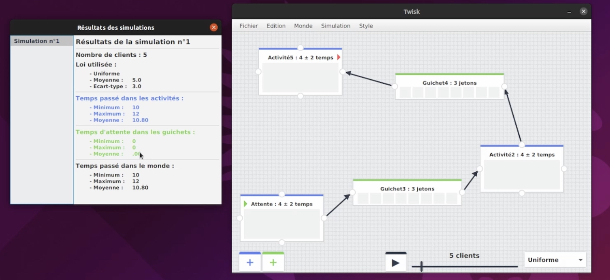

# Twisk

Cette application a été réalisé durant le quatrième semestre de ma formation à l'université Faculté des Sciences et Technologies de Vandoeuvre-lès-Nancy (54500 France)

## Description 

Logiciel de simulation à événements discrets pouvant simuler l'arrivée d'un nombre de clients dans un parcours d'activité selon la loi Normale, Poisson ou Uniforme.

Le parcours d'activité est à construire au préalable en créant et reliant les activités et les guichets entre eux. Chaque activité contient un nombre limité de clients et possède un temps approximatif.

Il est possible de sauvegarder le parcours et à chaque simulation, vous pouvez consulter une page statistique avec les informations principales (moyenne, écart-type, temps moyen passé dans le parcours, dans une activité ...)

## Aperçu 

## Dépendances

- OS : Ubuntu 20.04
- Sauvegarde JSON : [Dossier de dépendances](diagrammes/ressources/JSON)

## Diagrammes des classes
monde :

mondeIG :

outils :

simulation : 

vues :

exceptions : 

## Auteurs 
[LESNIAK Louis](https://github.com/LESNIAK-Louis)
 
JOFFROY Theo